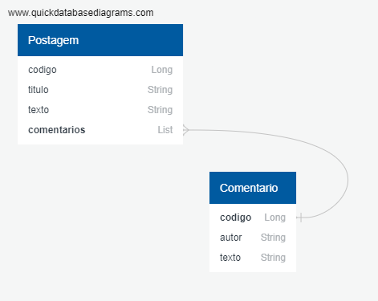

```
{
    "codigo": 3,
    "titulo": "Minha primeira postagem",
    "texto": "Testando minha mensagem",
    "comentarios": [
        {
            "codigo": 1,
            "autor": "Edgar Mendes",
            "texto": "Otimo Conteudo"
        },
        {
            "codigo": 2,
            "autor": "Leonardo Mendes",
            "texto": "Gostei da Postagem"
        }
    ]
}
```